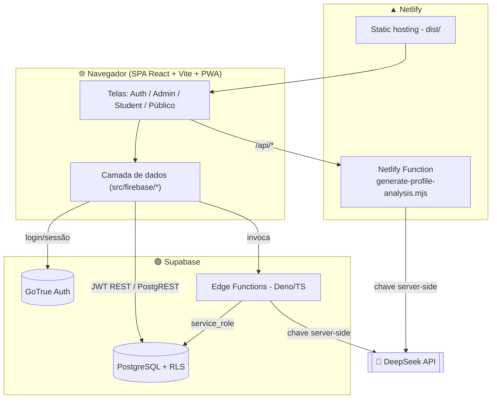

# 🛠️ Manual Técnico — Perfil Master (profileai)

> SaaS de avaliação comportamental **DISC + PQ (Sabotadores)**
> Stack: React + Vite · Supabase (PostgreSQL + Edge Functions) · Netlify
> *Vianexx AI · Repo: `github.com/Brefire79/PerfilMaster` (branch `main`)*

> ⚠️ **Todo o código vive na pasta `profileai/`.** Comandos abaixo assumem que você está dentro dela.

---

## 1. 🏛️ Arquitetura geral do sistema

O Perfil Master é uma **SPA (React)** que conversa com o **Supabase** (banco + autenticação + funções server-side) e com **uma Netlify Function** que faz proxy seguro para a IA (DeepSeek). Não há servidor próprio — tudo é serverless.



### Princípios de arquitetura (o que não é óbvio)

- **`src/firebase/` NÃO é Firebase.** É a camada de dados do **Supabase**, com nomes legados da migração:
  - `auth.js` — wrapper do Supabase Auth (GoTrue REST); sessão em `localStorage` (`profileai.supabase.session`) com refresh automático de token.
  - `firestore.js` — wrapper REST do **PostgREST**. Contém o mapa `CAMEL_TO_DB` (camelCase do app ↔ colunas lowercase do Postgres). **Toda coluna nova precisa ser registrada nesse mapa**, senão o INSERT/PATCH falha silenciosamente.
  - `functions.js` — invocador das Edge Functions (injeta o JWT do usuário ou a anon key).
  - `config.js` — stub vazio, só compatibilidade.
- **Colunas do Postgres são lowercase sem underscore** (`adminuid`, `criadoem`), exceto as do DELTA 7 (`cpf_consent`, `avaliado_id`, etc.).
- **RLS por facilitador:** cada admin enxerga **apenas** seus grupos/alunos/sessões (por `adminuid` ou grupo). Nunca `is_admin()` global, nunca `USING (true)` em tabelas `app_*`.
- **Fluxos públicos (sem login)** passam **só por Edge Functions** com `service_role` — o anônimo nunca acessa as tabelas `app_*` diretamente.
- **IA = DeepSeek, provider único, sempre server-side.** A chave fica apenas nos Secrets do Supabase e nas env vars do Netlify — **nunca** no bundle, `localStorage` ou URL. Fallback determinístico: `src/lib/localEngine.js`.

### Três modos de atendimento

1. **Grupo** (alunos com conta): admin cria grupo → convite (`/join/:token` → `/register?token=`) → Edge Function `consumeInvite` cria o usuário e o vincula ao grupo.
2. **Individual avulso** (conta sem grupo): convite com `groupid = NULL`; aluno fica vinculado ao admin via `app_users.adminuid`.
3. **Esporádico sem conta** (sessões): admin cria `app_sessoes` + `app_avaliados`; cada avaliado recebe um link por WhatsApp (`/avaliacao/:token`). Tudo via Edge Functions `buscarPorToken` / `atualizarStatus`.

### Stack resumida

| Camada | Tecnologia |
|---|---|
| Frontend | React 18 + Vite + JSX, Tailwind CSS, Zustand, react-router v6, i18next, vite-plugin-pwa, recharts |
| Camada de dados | REST puro p/ Supabase (PostgREST) em `src/firebase/` |
| Backend | Supabase: PostgreSQL + RLS + Auth (GoTrue) + Edge Functions (Deno/TS) |
| IA | DeepSeek server-side (Netlify Function + Edge `_shared/anthropic.ts`), fallback `localEngine` |
| Deploy | Netlify (frontend + 1 function) · Supabase (Edge Functions + DB) |
| Mobile | Capacitor (empacotamento opcional) |

---

## 2. ✅ Pré-requisitos para rodar localmente

| Requisito | Versão | Observação |
|---|---|---|
| **Node.js** | **20.x** | Definido em `netlify.toml` (`NODE_VERSION = "20"`) |
| **npm** | 9+ | Vem com o Node 20 |
| **Conta Supabase** | — | Projeto com as tabelas `app_*` (ver migrações) |
| **Supabase CLI** | 2.x | Só para deploy de Edge Functions / migrações |
| **Netlify CLI** | (vem como devDependency) | Para `npm run deploy` |
| **Chave DeepSeek** | — | Opcional em dev (sem ela, cai no `localEngine`). Obtida em platform.deepseek.com |

---

## 3. 🚀 Instalação e configuração (passo a passo)

```bash
# 1. Clonar o repositório
git clone https://github.com/Brefire79/PerfilMaster.git
cd PerfilMaster/profileai

# 2. Instalar dependências
npm install

# 3. Criar o arquivo de variáveis locais
cp .env.example .env.local
```

**4. Preencher o `.env.local`** com os dados do seu projeto Supabase:

```env
VITE_APP_URL=http://localhost:3000
VITE_SUPABASE_URL=https://SEU-REF.supabase.co
VITE_SUPABASE_ANON_KEY=sua_anon_key
```

> 🔒 **Nunca** coloque a chave de IA (`AI_API_KEY`) no `.env.local` nem no frontend — ela é **secreta** e fica só no servidor (Netlify env + Supabase Secrets).

**5. Aplicar o schema/RLS no banco** (Supabase Dashboard → **SQL Editor**): rode as migrações de `supabase/migrations/` em ordem cronológica. ⚠️ **Não use `supabase db push`** neste projeto — o histórico de migrações remoto está vazio (migrações sempre rodadas manualmente no SQL Editor), então o push tentaria reaplicar tudo do zero. As migrações são **idempotentes**.

**6. Configurar os Secrets do Supabase** (para as Edge Functions de IA):
```bash
supabase secrets set AI_API_KEY="sk-sua-chave-deepseek" --project-ref SEU-REF
```

**7. Rodar em desenvolvimento:**
```bash
npm run dev          # http://localhost:3000
```

### Comandos disponíveis

```bash
npm run dev              # servidor de desenvolvimento (porta 3000)
npm run build            # build de produção (Vite → dist/)
npm run preview          # serve o build localmente
npm run deploy           # bump de versão + build + netlify deploy --prod
npm run deploy:preview   # build + deploy de preview no Netlify
npm run bump             # bump patch (bump:minor / bump:major)
npm run cap:sync         # sync Capacitor (mobile)

# Edge Functions (Deno) — deploy individual (respeita verify_jwt do config.toml):
supabase functions deploy <nome> --project-ref <ref>
```

---

## 4. 🔌 Principais rotas, APIs e funções

### 4.1 Rotas do frontend (`src/routes/index.jsx`)

| Rota | Acesso | Descrição |
|---|---|---|
| `/login`, `/register`, `/forgot-password` | Público (auth) | Autenticação. `/register?token=` para cadastro por convite |
| `/join/:token` | Público | Redireciona o convite para `/register?token=` |
| `/avaliacao/:token` | **Público (sem login)** | Avaliação do esporádico (link WhatsApp) |
| `/resultado/:token` | **Público (sem login)** | Resultado do esporádico |
| `/admin/dashboard` | Admin | Painel do facilitador |
| `/admin/groups`, `/admin/groups/:id` | Admin | Grupos e detalhe |
| `/admin/students` | Admin | Alunos |
| `/admin/pessoas` | Admin | Central de Pessoas (unificação por CPF) |
| `/admin/sessoes` | Admin | Sessões de avaliação esporádica |
| `/admin/relatorio/:token` · `/admin/relatorio/aluno/:uid` | Admin | Relatório Oficial |
| `/admin/reports`, `/admin/modules`, `/admin/settings` | Admin | Relatórios, módulos, configurações |
| `/student/dashboard` · `/student/profile` | Aluno | Painel e perfil |
| `/student/assessment-wizard` · `/student/assessment/:id` | Aluno | Avaliação DISC + Sabotadores |

> Proteção por papel via `ProtectedRoute` (lê `useAuthStore`); rotas carregadas por **lazy loading**.

### 4.2 Edge Functions do Supabase (`supabase/functions/`)

| Função | Auth (`verify_jwt`) | Papel |
|---|---|---|
| `buscarPorToken` | ❌ pública | Dados do avaliado para link público (sem telefone/CPF) |
| `atualizarStatus` | ❌ pública | Transição de status + **cálculo DISC server-side** (28 questões) + grava respostas/perfil |
| `validateInviteToken` | ❌ pública | Valida convite no cadastro |
| `insightPerfil` | ❌ pública | Insights de IA do perfil (usado no resultado público) |
| `consumeInvite` | ✅ JWT | Consome convite: cria aluno, entra no grupo, marca usado (`service_role`) |
| `generateInviteLink` | ✅ JWT (admin) | Gera convite (grupo ou avulso) |
| `analyzeResponse`, `buildProfile`, `groupInsights`, `therapyFlag` | ✅ JWT | Funções de IA (DeepSeek) |
| `generateReport`, `calculate-assessment` | varia | Cálculo determinístico |

**Padrões das Edge Functions:**
- `handleCors(req)` no início de cada handler; respostas via `jsonResponse({...}, status, req)`.
- CORS com **allowlist** em `_shared/response.ts` (adicione novos domínios lá).
- IA compartilhada em `_shared/anthropic.ts` → `callAnthropic(system, user, maxTokens)`; a chave vem **só** de `AI_API_KEY`/`DEEPSEEK_API_KEY` dos Secrets (o cliente nunca envia chave).
- `verify_jwt` por função é definido em `supabase/config.toml` (o CLI respeita no deploy).

### 4.3 Netlify Function

| Endpoint | Método | Descrição |
|---|---|---|
| `/api/generate-profile-analysis` | `POST` | Proxy seguro DeepSeek. Body: `{ discScores, sabScores, localAnalysis }`. Resposta: `{ success, analysis, model }`. Sem chave no servidor → `503`. |

Mapeado em `netlify.toml` (`/api/* → /.netlify/functions/:splat`).

### 4.4 Camada de dados (`src/firebase/firestore.js`)

Funções de acesso ao Postgres via PostgREST (helpers internos: `selectRows`, `insertRow`, `updateRows`, `upsertRow`, `deleteRows`). Exemplos:

- **Usuários:** `createUser`, `getUser`, `updateUser`, `getUsersByGroup`, `getAvulsosByAdmin`
- **Grupos/Módulos:** `createGroup`, `getGroupsByAdmin`, `getModulesByGroup`
- **Avaliações/Perfis:** `createAssessment`, `submitAssessment`, `createProfile`, `getProfile`, `getProfilesByGroup`, `getProfilesByUids` (busca perfis de vários uids em 1 query — usado pela Central de Pessoas)
- **Sessões esporádicas:** `criarSessao`, `getSessoesByAdmin`, `criarAvaliado`, `getAvaliadosByAdmin`
- **Central de Pessoas (CPF):** `getPessoas`, `createIdentityLink`, `autoVincularPorCpf`
- **Painel Estratégico (DELTA 10):** `getAdminStrategy`, `saveAdminStrategy` (tabela `app_admin_strategies`, isolada por `adminuid`)

### 4.5 Tabelas do banco

`app_users`, `app_groups`, `app_modules`, `app_assessments`, `app_profiles`, `app_invites`, `app_sessoes`, `app_avaliados`, `app_sessao_respostas`, `app_group_reports`, `app_identity_links`, `app_admin_strategies`.

> **Fonte da verdade das policies RLS:** `supabase/migrations/20260609_delta8_seguranca.sql`.

### 4.6 Regras de negócio sensíveis (não alterar isoladamente)

- **Questões:** `src/constants/sampleQuestions.js` — 78 questões (28 DISC + 50 sabotadores). O fluxo público usa só as 28 DISC; os ids/pesos DISC estão **duplicados** em `atualizarStatus/index.ts` — alterou questão DISC, atualize os dois lugares.
- **Fórmula PQ Score:** `PQ Score = 100 − (média dos 3 maiores scores brutos × 10)`. Sincronizar entre `calculate-assessment`, `generate-report` e `src/lib/localEngine.js`.
- **Cores DISC canônicas:** D `#EF4444` · I `#F59E0B` · S `#22C55E` · C `#6366F1`.
- **Relatório Oficial × "Ver perfil":** o `RelatorioOficial` é DISC-only por origem (fluxo de sessão usa só 28 questões). Para **contas de aluno** (uid), `getAvaliadoLikeFromUid` traz também `saboteurPatterns`/`derailmentRisks`/`summary` do `app_profiles`, e o relatório renderiza a **§ 3.1 (Padrões Sabotadores e Riscos de Derailment)** quando esses dados existem — paridade com o `ProfileDetail` ("Ver perfil"). Avaliados de sessão não têm esses dados → seção oculta.

---

## 5. 🧪 Como rodar os testes

> ⚠️ **Este projeto não possui testes automatizados nem linter configurados** (não há Jest/Vitest/ESLint no `package.json`).

A **validação oficial** é:

```bash
# 1. Build de produção precisa ficar verde (sem erros)
npm run build

# 2. Verificação manual no preview/dev
npm run dev
```

### Checklist de smoke test (manual)

1. `/login` carrega sem erros no console.
2. `/avaliacao/token-invalido` e `/resultado/token-invalido` mostram **erro amigável** ("Link inválido / Resultado não encontrado").
3. Console **sem** warnings de React Router e **sem** erros.
4. Rebrand correto (título e rodapé exibem **"Perfil Master"**).
5. (Opcional) Testar a IA no ar:
   ```bash
   curl -X POST https://perfilmaster.netlify.app/api/generate-profile-analysis \
     -H "Content-Type: application/json" \
     -d '{"discScores":{"D":50,"I":60,"S":40,"C":70},"sabScores":{"judge":5},"localAnalysis":{"summary":"teste"}}'
   # Esperado: HTTP 200 {"success":true,...,"model":"deepseek-chat"}
   ```

> 💡 Para adicionar testes no futuro, recomenda-se **Vitest** (integra nativamente com Vite) + **@testing-library/react**, começando pelas funções puras de `src/lib/localEngine.js` (cálculo DISC/PQ).

---

## 📎 Apêndice — estrutura de pastas (resumo)

```
profileai/
├── src/
│   ├── routes/index.jsx        # rotas + proteção por papel
│   ├── pages/                  # telas (auth/ admin/ student/ public/ shared/)
│   ├── components/             # UI, assessment, profile, group, layout, sessao
│   ├── firebase/               # camada de dados Supabase (auth, firestore, functions)
│   ├── lib/                    # localEngine, apiKeyManager, appUrl, cpf
│   ├── store/                  # Zustand (authStore, sessaoStore, ...)
│   ├── constants/              # sampleQuestions (78 questões), siglas
│   └── i18n/                   # pt-BR / en / es
├── supabase/
│   ├── functions/              # Edge Functions (Deno/TS) + _shared/
│   ├── migrations/             # SQL (fonte da verdade do schema/RLS)
│   └── config.toml             # verify_jwt por função
├── netlify/functions/          # generate-profile-analysis.mjs (proxy DeepSeek)
├── netlify.toml                # redirects, headers/CSP, NODE_VERSION
└── vite.config.js              # build, PWA, manualChunks
```

---

*Perfil Master · Vianexx AI · Manual Técnico · atualizado 12/06/2026*
