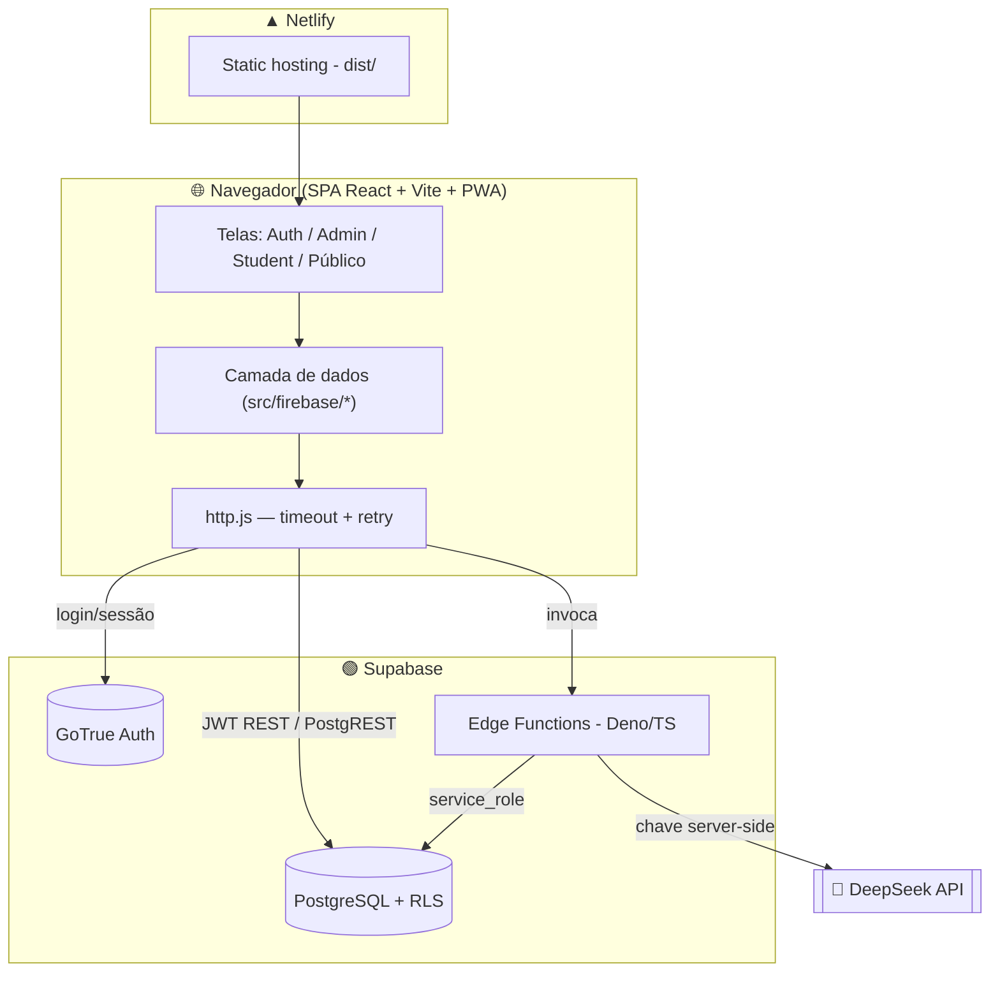

# 🛠️ Manual Técnico — Perfil Master (profileai)

> SaaS de avaliação comportamental **DISC + PQ (Sabotadores)**
> Stack: React + Vite · Supabase (PostgreSQL + Edge Functions) · Netlify
> *Vianexx AI · Repo: `github.com/Brefire79/PerfilMaster` (branch `main`)*

> ⚠️ **Todo o código vive na pasta `profileai/`.** Comandos abaixo assumem que você está dentro dela.

---

## 1. 🏛️ Arquitetura geral do sistema

O Perfil Master é uma **SPA (React)** que conversa com o **Supabase** (banco + autenticação + funções server-side). Não há servidor próprio — tudo é serverless. O Netlify só serve os arquivos estáticos.

> ⚠️ **Desde 27/07/2026 não existem Netlify Functions.** A única (`generate-profile-analysis`) era um proxy DeepSeek **sem autenticação e com CORS `*`** — qualquer pessoa podia chamar e queimar a cota de IA — e nenhuma tela a usava. Foi removida junto com o bloco `[functions]` e o redirect `/api/*` do `netlify.toml` (C2 da auditoria). **Toda IA passa por Edge Functions do Supabase.**


```mermaid
flowchart TD
    subgraph Cliente["🌐 Navegador (SPA React + Vite + PWA)"]
        UI[Telas: Auth / Admin / Student / Público]
        HTTP["http.js — timeout + retry"]
        DL["Camada de dados (src/firebase/*)"]
    end

    subgraph Netlify["▲ Netlify"]
        Static[Static hosting - dist/]
    end

    subgraph Supabase["🟢 Supabase"]
        Auth[(GoTrue Auth)]
        PG[(PostgreSQL + RLS)]
        EF[Edge Functions - Deno/TS]
    end

    DeepSeek[["🤖 DeepSeek API"]]

    UI --> DL
    DL --> HTTP
    HTTP -->|JWT REST / PostgREST| PG
    HTTP -->|login/sessão| Auth
    HTTP -->|invoca| EF
    EF -->|service_role| PG
    EF -->|chave server-side| DeepSeek
    Static --> UI
```

### Princípios de arquitetura (o que não é óbvio)

- **`src/firebase/` NÃO é Firebase.** É a camada de dados do **Supabase**, com nomes legados da migração:
  - `auth.js` — wrapper do Supabase Auth (GoTrue REST); sessão em `localStorage` (`profileai.supabase.session`) com refresh automático de token.
  - `firestore.js` — wrapper REST do **PostgREST**. Contém o mapa `CAMEL_TO_DB` (camelCase do app ↔ colunas lowercase do Postgres). **Toda coluna nova precisa ser registrada nesse mapa**, senão o INSERT/PATCH falha silenciosamente.
  - `functions.js` — invocador das Edge Functions (injeta o JWT do usuário ou a anon key).
  - `http.js` — **camada única de rede** (ver §1.1). Todo fetch passa por aqui.
  - `config.js` — stub vazio, só compatibilidade.
- **Colunas do Postgres são lowercase sem underscore** (`adminuid`, `criadoem`), exceto as do DELTA 7 (`cpf_consent`, `avaliado_id`, etc.).
- **RLS por facilitador:** cada admin enxerga **apenas** seus grupos/alunos/sessões (por `adminuid` ou grupo). Nunca `is_admin()` global, nunca `USING (true)` em tabelas `app_*`.
- **Fluxos públicos (sem login)** passam **só por Edge Functions** com `service_role` — o anônimo nunca acessa as tabelas `app_*` diretamente.
- **IA = DeepSeek, provider único, sempre server-side, só via Edge Functions.** A chave fica apenas nos Secrets do Supabase — **nunca** no bundle, `localStorage`, URL ou env do Netlify. Fallback determinístico: `src/lib/localEngine.js`.

### 1.1 Camada de rede (`src/firebase/http.js`)

Criada em 27/07/2026 (C1 da auditoria). **Nenhum fetch do app tinha prazo** — quando o projeto Supabase pausou por inatividade (Free tier), a promise nunca resolvia, `useAuth` ficava preso, `initialized` nunca virava `true` e o app exibia "Carregando..." para sempre. O avaliado travava em "Verificando seu link...".

| Export | Papel |
|---|---|
| `fetchComTimeout(url, opts, ms)` | `fetch` com `AbortController`; erro classificado |
| `fetchComRetry(url, opts, ms, n)` | idem + 2 tentativas com backoff — **só para GET** |
| `isBackendDown(err)` | `true` se o erro é de transporte (não é 4xx/5xx da app) |
| `mensagemDeRede(err)` | texto pronto para o usuário final |
| `TIMEOUT` | `DB: 12s` · `AUTH: 12s` · `FUNCTION: 30s` (Edge com IA demora mais) |

Códigos de erro: `backend/timeout`, `backend/offline`, `backend/unreachable`.

Consequências no comportamento:

- `authStore.initError` + `<BackendIndisponivel/>` substituem o spinner infinito em `RootRedirect`, `ProtectedRoute` e `AlreadyAuthRoute`.
- `useAuth` **não assume mais `student`** quando a leitura de `app_users` falha por rede — isso rebaixava admin silenciosamente. Só assume no caso legítimo (conta sem linha em `app_users`).
- `refreshSession` **não desloga** em queda de rede; só quando o servidor responde recusando o `refresh_token`.
- `AvaliacaoPublica` separa "servidor fora" (tela `SEM_CONEXAO`) de "link inválido".

> **Regra:** chamada de rede nova usa `http.js`. `fetch` direto recria o bug.

### Três modos de atendimento

1. **Grupo** (alunos com conta): admin cria grupo → convite (`/join/:token` → `/register?token=`) → Edge Function `consumeInvite` cria o usuário e o vincula ao grupo.
2. **Individual avulso** (conta sem grupo): convite com `groupid = NULL`; aluno fica vinculado ao admin via `app_users.adminuid`.
3. **Esporádico sem conta** (sessões): admin cria `app_sessoes` + `app_avaliados`; cada avaliado recebe um link por WhatsApp (`/avaliacao/:token`). Tudo via Edge Functions `buscarPorToken` / `atualizarStatus`.

### Stack resumida

| Camada | Tecnologia |
|---|---|
| Frontend | React 18 + Vite + JSX, Tailwind CSS, Zustand, react-router v6, i18next, vite-plugin-pwa, recharts |
| Camada de dados | REST puro p/ Supabase (PostgREST) em `src/firebase/` |
| Backend | Supabase: PostgreSQL + RLS + Auth (GoTrue) + Edge Functions (Deno/TS) |
| IA | DeepSeek server-side (Netlify Function + Edge `_shared/anthropic.ts`), fallback `localEngine` |
| Deploy | Netlify (frontend + 1 function) · Supabase (Edge Functions + DB) |
| Mobile | Capacitor (empacotamento opcional) |

---

## 2. ✅ Pré-requisitos para rodar localmente

| Requisito | Versão | Observação |
|---|---|---|
| **Node.js** | **20.x** | Definido em `netlify.toml` (`NODE_VERSION = "20"`) |
| **npm** | 9+ | Vem com o Node 20 |
| **Conta Supabase** | — | Projeto com as tabelas `app_*` (ver migrações) |
| **Supabase CLI** | 2.x | Só para deploy de Edge Functions / migrações |
| **Netlify CLI** | (vem como devDependency) | Para `npm run deploy` |
| **Chave DeepSeek** | — | Opcional em dev (sem ela, cai no `localEngine`). Obtida em platform.deepseek.com |

---

## 3. 🚀 Instalação e configuração (passo a passo)

```bash
# 1. Clonar o repositório
git clone https://github.com/Brefire79/PerfilMaster.git
cd PerfilMaster/profileai

# 2. Instalar dependências
npm install

# 3. Criar o arquivo de variáveis locais
cp .env.example .env.local
```

**4. Preencher o `.env.local`** com os dados do seu projeto Supabase:

```env
VITE_APP_URL=http://localhost:3000
VITE_SUPABASE_URL=https://SEU-REF.supabase.co
VITE_SUPABASE_ANON_KEY=sua_anon_key
```

> 🔒 **Nunca** coloque a chave de IA (`AI_API_KEY`) no `.env.local` nem no frontend — ela é **secreta** e fica só no servidor (Netlify env + Supabase Secrets).

**5. Aplicar o schema/RLS no banco** (Supabase Dashboard → **SQL Editor**): rode as migrações de `supabase/migrations/` em ordem cronológica. ⚠️ **Não use `supabase db push`** neste projeto — o histórico de migrações remoto está vazio (migrações sempre rodadas manualmente no SQL Editor), então o push tentaria reaplicar tudo do zero. As migrações são **idempotentes**.

**6. Configurar os Secrets do Supabase** (para as Edge Functions de IA):
```bash
supabase secrets set AI_API_KEY="sk-sua-chave-deepseek" --project-ref SEU-REF
```

**7. Rodar em desenvolvimento:**
```bash
npm run dev          # http://localhost:3000
```

### Comandos disponíveis

```bash
npm run dev              # servidor de desenvolvimento (porta 3000)
npm run build            # build de produção (Vite → dist/)
npm run preview          # serve o build localmente
npm run deploy           # bump de versão + build + netlify deploy --prod
npm run deploy:preview   # build + deploy de preview no Netlify
npm run bump             # bump patch (bump:minor / bump:major)
npm run cap:sync         # sync Capacitor (mobile)

# Edge Functions (Deno) — deploy individual (respeita verify_jwt do config.toml):
supabase functions deploy <nome> --project-ref <ref>
```

---

## 4. 🔌 Principais rotas, APIs e funções

### 4.1 Rotas do frontend (`src/routes/index.jsx`)

| Rota | Acesso | Descrição |
|---|---|---|
| `/login`, `/register`, `/forgot-password` | Público (auth) | Autenticação. `/register?token=` para cadastro por convite |
| `/join/:token` | Público | Redireciona o convite para `/register?token=` |
| `/avaliacao/:token` | **Público (sem login)** | Avaliação do esporádico (link WhatsApp) |
| `/resultado/:token` | **Público (sem login)** | Resultado do esporádico |
| `/admin/dashboard` | Admin | Painel do facilitador |
| `/admin/groups`, `/admin/groups/:id` | Admin | Grupos e detalhe |
| `/admin/students` | Admin | Alunos |
| `/admin/pessoas` | Admin | Central de Pessoas (unificação por CPF) |
| `/admin/sessoes` | Admin | Sessões de avaliação esporádica |
| `/admin/relatorio/:token` · `/admin/relatorio/aluno/:uid` | Admin | Relatório Oficial |
| `/admin/reports`, `/admin/modules`, `/admin/settings` | Admin | Relatórios, módulos, configurações |
| `/student/dashboard` · `/student/profile` | Aluno | Painel e perfil |
| `/student/assessment-wizard` · `/student/assessment/:id` | Aluno | Avaliação DISC + Sabotadores |

> Proteção por papel via `ProtectedRoute` (lê `useAuthStore`); rotas carregadas por **lazy loading**.

### 4.2 Edge Functions do Supabase (`supabase/functions/`)

| Função | Auth (`verify_jwt`) | Papel |
|---|---|---|
| `buscarPorToken` | ❌ pública | Dados do avaliado para link público (sem telefone/CPF) |
| `atualizarStatus` | ❌ pública | Transição de status + **cálculo DISC server-side** (28 questões) + grava respostas/perfil |
| `validateInviteToken` | ❌ pública | Valida convite no cadastro |
| `insightPerfil` | ❌ pública | Insights de IA do perfil (usado no resultado público) |
| `consumeInvite` | ✅ JWT | Consome convite: cria aluno, entra no grupo, marca usado (`service_role`) |
| `generateInviteLink` | ✅ JWT (admin) | Gera convite (grupo ou avulso) |
| `analyzeResponse`, `buildProfile`, `groupInsights`, `therapyFlag` | ✅ JWT | Funções de IA (DeepSeek) |
| `generateReport`, `calculate-assessment` | varia | Cálculo determinístico |

**Padrões das Edge Functions:**
- `handleCors(req)` no início de cada handler; respostas via `jsonResponse({...}, status, req)`.
- CORS com **allowlist** em `_shared/response.ts` (adicione novos domínios lá).
- IA compartilhada em `_shared/anthropic.ts` → `callAnthropic(system, user, maxTokens)`; a chave vem **só** de `AI_API_KEY`/`DEEPSEEK_API_KEY` dos Secrets (o cliente nunca envia chave).
- `verify_jwt` por função é definido em `supabase/config.toml` (o CLI respeita no deploy).

### 4.3 Netlify Functions — **não existem mais**

Removidas em 27/07/2026 (C2 da auditoria). O `netlify.toml` não tem mais bloco `[functions]` nem redirect `/api/*`; o Netlify apenas serve `dist/`.

O que havia: `/api/generate-profile-analysis`, proxy DeepSeek **sem autenticação, com `Access-Control-Allow-Origin: *` e sem rate limit** — endereço público que qualquer um podia chamar para consumir a cota de IA, com parte do prompt vinda do body (prompt injection). Sua única consumidora (`src/lib/apiKeyManager.js`) não era chamada por nenhuma tela.

**Se um dia voltar a existir função no Netlify**, ela precisa de: JWT do Supabase validado, CORS restrito ao domínio próprio, limite de tamanho de body e rate limit por IP.

### 4.4 Camada de dados (`src/firebase/firestore.js`)

Funções de acesso ao Postgres via PostgREST (helpers internos: `selectRows`, `insertRow`, `updateRows`, `upsertRow`, `deleteRows`). Exemplos:

- **Usuários:** `createUser`, `getUser`, `updateUser`, `getUsersByGroup`, `getAvulsosByAdmin`
- **Grupos/Módulos:** `createGroup`, `getGroupsByAdmin`, `getModulesByGroup`
- **Avaliações/Perfis:** `createAssessment`, `submitAssessment`, `createProfile`, `getProfile`, `getProfilesByGroup`, `getProfilesByUids` (busca perfis de vários uids em 1 query — usado pela Central de Pessoas)
- **Sessões esporádicas:** `criarSessao`, `getSessoesByAdmin`, `criarAvaliado`, `getAvaliadosByAdmin`
- **Central de Pessoas (CPF):** `getPessoas`, `createIdentityLink`, `autoVincularPorCpf`
- **Painel Estratégico (DELTA 10):** `getAdminStrategy`, `saveAdminStrategy` (tabela `app_admin_strategies`, isolada por `adminuid`)

### 4.5 Tabelas do banco

`app_users`, `app_groups`, `app_modules`, `app_assessments`, `app_profiles`, `app_invites`, `app_sessoes`, `app_avaliados`, `app_sessao_respostas`, `app_group_reports`, `app_identity_links`, `app_admin_strategies`.

> **Fonte da verdade das policies RLS:** `supabase/migrations/20260609_delta8_seguranca.sql`.

### 4.6 Regras de negócio sensíveis (não alterar isoladamente)

- **Questões:** `src/constants/sampleQuestions.js` — 78 questões (28 DISC + 50 sabotadores), todas likert5. Desde o **DELTA 19** o fluxo público é **Completo (78)**: `AvaliacaoPublica` aplica DISC→Sabotadores e `atualizarStatus` pontua os dois. Ids/pesos DISC e o scoring de Sabotadores estão **duplicados** em `atualizarStatus/index.ts` — mexeu em um lado, mexa no outro (e o contrato de scoring cobre a parte DISC).
- **Motor DISC canônico:** `src/lib/discScoring.js` — `(valor−1)/4 × peso`, média ponderada por dimensão × 100. Lê `sampleQuestions.js` em runtime (sincroniza sozinho); o array `QUESTIONS` do Edge é atualizado à mão.
- **Fórmula PQ Score:** `PQ Score = 100 − (média dos 3 maiores scores brutos × 10)`. Sincronizar entre `calculate-assessment`, `generate-report`, `src/lib/localEngine.js` e `src/lib/saboteurScoring.js`.
- **Acoplamento front ↔ Edge nos Sabotadores:** o front deriva a chave pelo campo `dimension`; o Edge deriva por regex no id (`/^q_sab_([a-z]+)_\d+$/`) + `SAB_SLUG_TO_KEY`. Desde 27/07/2026 o **contrato de scoring prova a equivalência** (mapeamento questão a questão, allowlist dos 50 ids e `pqScore` idêntico). Id de sabotador fora do padrão `q_sab_<slug>_NN` quebra o `npm test` — antes era ignorado em silêncio pelo Edge.

### 4.7 Validação das respostas no fluxo público (A1/A3)

`atualizarStatus` era a porta aberta do sistema: gravava `payload.respostas` com o objeto cru do cliente e concluía a avaliação com **uma única resposta**.

| Regra | Valor |
|---|---|
| Ids aceitos | allowlist `IDS_VALIDOS` — 28 DISC + 50 `q_sab_<slug>_01..05` |
| Valores | inteiro forçado, faixa **1-5**; fora disso a resposta é descartada |
| Teto do payload | 200 chaves (78 legítimas) |
| Cobertura mínima DISC | **26** de 28 |
| Cobertura mínima Sabotadores | **45** de 50 — *só exigida se vier algum* |
| Recusa | HTTP **422**, `code: 'assessment/incomplete'`, com ids faltantes |

A tolerância de 2 questões existe para não invalidar uma avaliação por um item perdido; concluir com meia dúzia de respostas, não passa. Avaliado **DISC-only** (link anterior ao DELTA 19) continua válido: sem nenhuma `q_sab_*`, o bloco de sabotadores não é cobrado.

No front, `AvaliacaoPublica` intercepta antes de enviar — "Finalizar" com questões em branco leva à primeira pendência com aviso, e o 422 do servidor dispara `VOLTAR_INCOMPLETO`.
- **Cores DISC canônicas:** D `#EF4444` · I `#F59E0B` · S `#22C55E` · C `#6366F1`.
- **Relatório Oficial × "Ver perfil":** o `RelatorioOficial` é DISC-only por origem (fluxo de sessão usa só 28 questões). Para **contas de aluno** (uid), `getAvaliadoLikeFromUid` traz também `saboteurPatterns`/`derailmentRisks`/`summary` do `app_profiles`, e o relatório renderiza a **§ 3.1 (Padrões Sabotadores e Riscos de Derailment)** quando esses dados existem — paridade com o `ProfileDetail` ("Ver perfil"). Avaliados de sessão não têm esses dados → seção oculta.

---

## 5. 🧪 Como rodar os testes

Não são testes de unidade — são **contratos** que travam invariantes que o projeto não pode violar. Rodam em Node puro, sem dependência extra.

```bash
npm test     # verify-scoring-contract.mjs + verify-security-contract.mjs
npm run check   # test + build — o gate antes de qualquer deploy
```

| Contrato | O que garante |
|---|---|
| `scripts/verify-scoring-contract.mjs` | 78 questões (28 DISC + 50 Sab), ids únicos, todas likert5, extremos do DISC (0/100), PQ nos extremos (90/50) e que **os ids e pesos DISC do Edge `atualizarStatus` batem com `sampleQuestions.js`** |
| `scripts/verify-security-contract.mjs` | nenhum secret de servidor citado em `src/`, `deleteAccount` via Edge com JWT + confirmação explícita, migration de hardening presente, `changePassword` reautenticando, e `firestore/functions/auth` fazendo rede por `http.js` |

O contrato de scoring também prova a equivalência **front ↔ Edge dos Sabotadores** (§4.6) e trava a presença das validações A1/A3 e das checagens de erro C3 em `atualizarStatus` — refatorar essas partes para fora quebra o `npm test`.

Foi o contrato de scoring que pegou a divergência de pesos DISC da auditoria de 07/07/2026.

Desde 27/07/2026, `npm run deploy` e `npm run deploy:preview` rodam `npm test` antes do bump/build — contrato violado quebra o deploy cedo.

> ⚠️ **Não há GitHub Actions neste repo** (não existe `.github/workflows`). Os contratos só rodam localmente. Criar a Action que executa `npm run check` em todo push é item aberto do Sprint 3. Também não há linter de estilo.

### Smoke test do caminho crítico (rodar antes de todo deploy de produção)

O caminho do avaliado é onde o produto ganha ou perde. São ~4 minutos e cobrem os três achados críticos da auditoria de uma vez:

1. Anônimo abre `/avaliacao/:token` → boas-vindas carregam em < 3s.
2. Responder 3 questões → **F5** → volta na 4ª (retomada via `localStorage`).
3. Concluir → redireciona para `/resultado/:token` com o perfil.
4. Conferir no banco: `app_avaliados.status = 'concluido'` **e** `perfil` preenchido.
5. Facilitador abre `/admin/relatorio/:token` → relatório monta com DISC + PQ.

### Smoke test geral

1. `/login` carrega sem erros no console.
2. `/avaliacao/token-invalido` mostra **"Link inválido ou expirado"**.
3. **DevTools → Network → Offline** e recarregar: deve aparecer a tela **"Servidor fora do ar"** em ~12s (regressão do C1 — antes girava para sempre).
4. Responder 3 questões e forçar `atualizarStatus` com `novoStatus: 'concluido'`: deve devolver **422 `assessment/incomplete`**, nunca um perfil (regressão do A1).
4. Console sem warnings de React Router.
5. Título e rodapé exibem **"Perfil Master"**.

> 💡 Para evoluir: **Vitest** + **@testing-library/react** nas funções puras (`discScoring.js`, `saboteurScoring.js`, `localEngine.js`), e Playwright para automatizar o smoke test do caminho crítico.

---

## 📎 Apêndice — estrutura de pastas (resumo)

```
profileai/
├── src/
│   ├── routes/index.jsx        # rotas + proteção por papel
│   ├── pages/                  # telas (auth/ admin/ student/ public/ shared/)
│   ├── components/             # UI, assessment, profile, group, layout, sessao
│   ├── firebase/               # camada de dados Supabase (auth, firestore, functions, http)
│   ├── lib/                    # localEngine, discScoring, saboteurScoring, mestreLocal, appUrl, cpf
│   ├── store/                  # Zustand (authStore, sessaoStore, ...)
│   ├── constants/              # sampleQuestions (78 questões), siglas
│   └── i18n/                   # pt-BR / en / es
├── supabase/
│   ├── functions/              # Edge Functions (Deno/TS) + _shared/
│   ├── migrations/             # SQL (fonte da verdade do schema/RLS)
│   └── config.toml             # verify_jwt por função
├── scripts/                    # verify-scoring-contract.mjs, verify-security-contract.mjs
├── netlify.toml                # redirects, headers/CSP, NODE_VERSION (sem [functions])
└── vite.config.js              # build, PWA, manualChunks
```

---

*Perfil Master · Vianexx AI · Manual Técnico · atualizado 27/07/2026 (auditoria + Sprints 1 e 2)*
